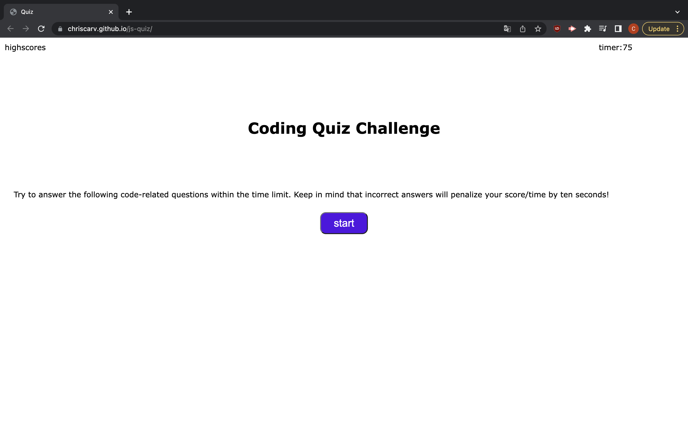
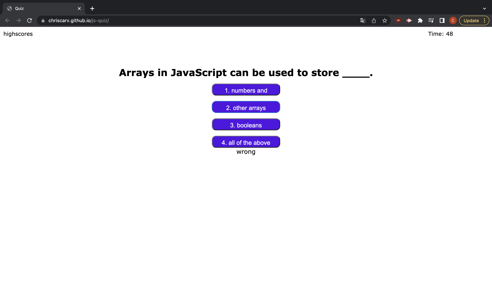
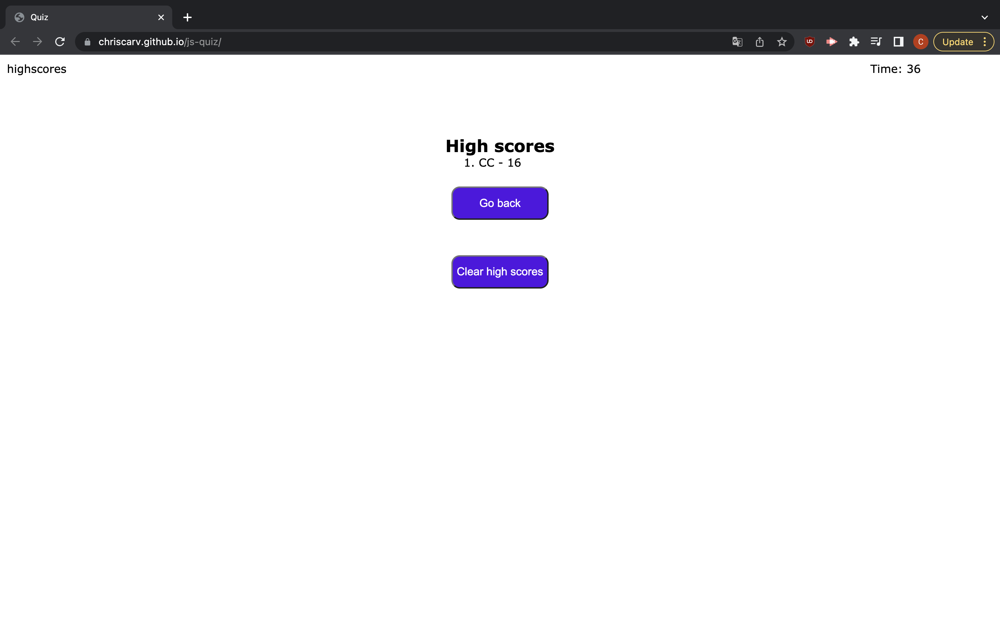

# Quiz application
## purpose
An interactive quiz application that displays questions about javascript. Quiz is timed for 75 seconds and there is a 10 second penalty for every questin answered wrong. Score is displayed at the end.

## built with
* html
* css
* javascript

## website
https://chriscarv.github.io/js-quiz/

